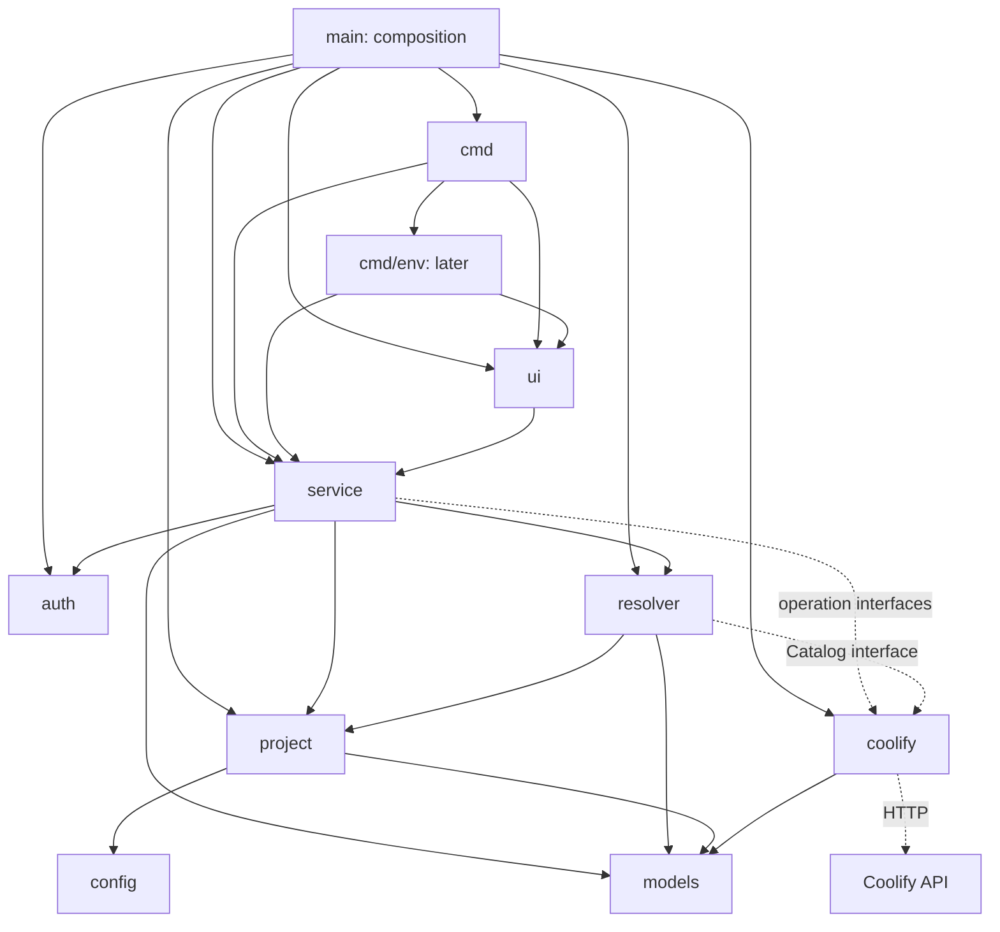
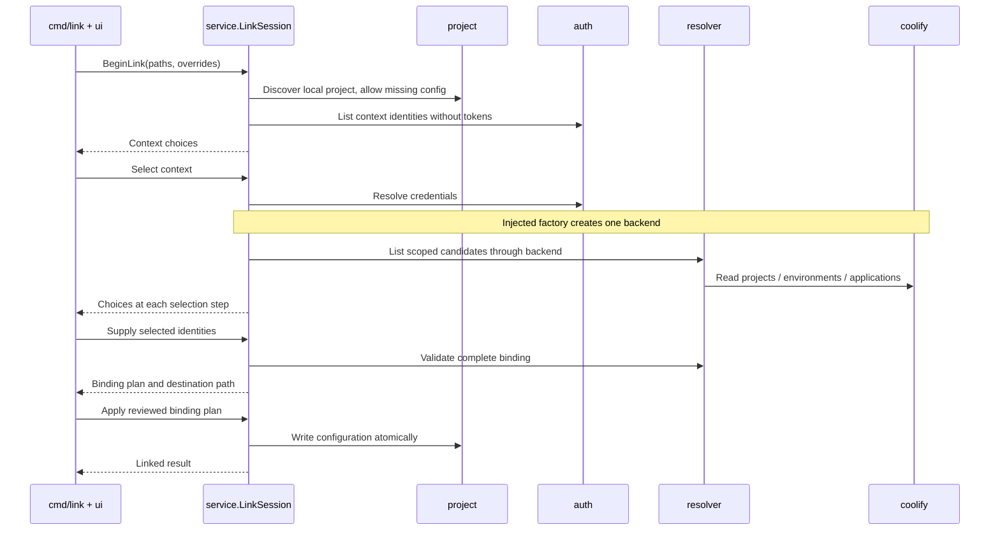

# Coolship architecture

This document is based on [README.md](README.md) and the complete [engineering brief](REQUEST.md).

Milestone 1 is implemented: the module, `link`, `status`, `deploy`, and `logs`, with the packages and boundaries described below. Sections that describe later work are marked, and [ROADMAP.md](ROADMAP.md) tracks status. Where this document describes behavior that is not yet built, it states a decision to follow, not an existing capability.

The central decision is to resolve the current directory into one explicit `project.Context`, then reuse that resolution pipeline for every application workflow. Cobra owns the interaction. Application services own the workflow. A small Coolify adapter owns HTTP communication.

## 1. What the reference codebases establish

The following local checkouts were inspected. These revisions identify the source observations, not a promise of compatibility with every released version. The inspected source paths had no tracked modifications. Source links below point into the sibling local checkouts.

| Reference | Inspected revision | Role |
| --- | --- | --- |
| `/data/projects/coolify-cli` | `76ca47187a0c34b6f68c5c44b192fc457749e2c7` | Go conventions, configuration compatibility, potential upstream target. |
| `/data/projects/workers-sdk` | `36aed7f0f2db5056af9df917cf6c22a2be950b1e` | Wrangler project discovery, command infrastructure, and developer workflows. |
| `/data/projects/coolify` | `424dbd36fff39a9ccd22efbee019cf490dcf9fc8` | Server routes and behavior that constrain the proposed client. |

### Coolify CLI: conventions to keep and boundaries to improve

- **Command organization:** [cmd/root.go](../coolify-cli/cmd/root.go) registers Cobra trees through `New…Command()` constructors. [cmd/application/application.go](../coolify-cli/cmd/application/application.go) groups application commands, aliases, and nested environment commands. Keep these constructor and directory conventions. Use explicit dependency arguments instead of package globals and `init()` registration.
- **Configuration and authentication:** [internal/config/config.go](../coolify-cli/internal/config/config.go), [instance.go](../coolify-cli/internal/config/instance.go), and [internal/cli/client.go](../coolify-cli/internal/cli/client.go) establish the JSON format, default instance, context selection, and token override. The root also initializes Viper, while the client helper loads typed configuration directly. Coolship should read the compatible format through one typed adapter, without inheriting both loading paths.
- **Client and services:** [internal/api/client.go](../coolify-cli/internal/api/client.go) supplies bearer authentication, `/api/v1/`, context-aware requests, timeouts, and retries. [internal/service/project.go](../coolify-cli/internal/service/project.go) and [deployment.go](../coolify-cli/internal/service/deployment.go) wrap resource endpoints. Keep constructor injection and context propagation. Initially place transport and endpoint wrappers together in `internal/coolify`; reserve Coolship's `internal/service` for project workflows.
- **Models and errors:** [internal/models/project.go](../coolify-cli/internal/models/project.go) holds response types. [internal/api/error.go](../coolify-cli/internal/api/error.go) provides typed HTTP errors; callers wrap errors with `%w`. Keep these conventions, but keep display tags and formatting out of core models.
- **Resource lookup:** [cmd/deployment/name.go](../coolify-cli/cmd/deployment/name.go) lists resources and selects the first exact name match. Most application commands take UUIDs. Coolship needs hierarchy-scoped resolution and explicit ambiguity errors, shared by all commands.
- **Output:** [internal/output/formatter.go](../coolify-cli/internal/output/formatter.go) abstracts table, JSON, and pretty output with an injectable writer. Some commands print directly, and deployment services also format logs. Keep writer injection and machine output; place all terminal formatting in `ui`. Do not copy direct command printing or service formatting.
- **Long-running operations:** [cmd/application/logs.go](../coolify-cli/cmd/application/logs.go) polls snapshots every two seconds and manages signals inside Cobra. Coolship should put polling in services and cancellation at the process boundary.
- **Environment variables:** [cmd/application/env/sync.go](../coolify-cli/cmd/application/env/sync.go) combines file parsing, comparison, API mutation, and progress output inside a handler. Preserve the API's variable attributes from [internal/models/application.go](../coolify-cli/internal/models/application.go), but move synchronization policy into an application service when that feature is built.

The useful configuration, API, models, services, and output packages are under Go's `internal/` boundary. A separate Coolship module cannot import them directly. Do not bypass that boundary with a module name trick, `replace`, a fork, or execution of the `coolify` binary. Compatibility is initially a tested file-format contract plus a small independent API adapter.

### Wrangler: patterns to adapt

Wrangler is in `packages/wrangler`, with reusable infrastructure also extracted into sibling packages. It does not provide one universal, fully resolved remote project context; Coolship's context is a design derived from the brief.

| Concern | Observed source and behavior | Coolship decision |
| --- | --- | --- |
| Command infrastructure | [core/create-command.ts](../workers-sdk/packages/wrangler/src/core/create-command.ts), [core/register-yargs-command.ts](../workers-sdk/packages/wrangler/src/core/register-yargs-command.ts), and [core/types.ts](../workers-sdk/packages/wrangler/src/core/types.ts) define commands and provide shared configuration, SDK access, logging, prompts, and error handling. | Use Cobra constructors and one shared service preparation path. Keep terminal helpers out of the resolved project context. |
| Discovery and configuration | [workers-utils/config/config-helpers.ts](../workers-sdk/packages/workers-utils/src/config/config-helpers.ts) handles explicit paths, upward discovery, and optional generated-config redirects. [wrangler/config/index.ts](../workers-sdk/packages/wrangler/src/config/index.ts) delegates parsing and normalization to shared utilities. | Separate finding a file from parsing and validating its contents. Start with TOML only; do not add generated-config redirection. |
| Environment selection | [workers-utils/config/validation.ts](../workers-sdk/packages/workers-utils/src/config/validation.ts) resolves `--env` or `CLOUDFLARE_ENV` and distinguishes inheritable fields from environment-specific fields. | Define explicit precedence and fail on missing Coolify environments. Do not copy Workers inheritance rules or silently synthesize remote environments. |
| Working directory and aliases | [wrangler/index.ts](../workers-sdk/packages/wrangler/src/index.ts) registers the hierarchy and aliases, supports `--config` and `--env`, and changes the process directory for `--cwd`. | Support working-directory and configuration overrides, but pass absolute paths instead of using `os.Chdir`. Keep a small command vocabulary. |
| Setup and linking | [init.ts](../workers-sdk/packages/wrangler/src/init.ts) can delegate scaffolding to Create Cloudflare or import a Worker; [deploy/autoconfig.ts](../workers-sdk/packages/wrangler/src/deploy/autoconfig.ts) handles setup during deployment. | Keep project binding reusable and explicit. `link` selects an existing application; deployment does not silently create resources. |
| Deployment | [deploy/index.ts](../workers-sdk/packages/wrangler/src/deploy/index.ts) delegates work to bundle infrastructure and `@cloudflare/deploy-helpers`. | Keep a thin command handler and an independently testable deployment service. Coolify performs the build and deployment. |
| Local development | [dev/start-dev.ts](../workers-sdk/packages/wrangler/src/dev/start-dev.ts) and [api/startDevWorker/DevEnv.ts](../workers-sdk/packages/wrangler/src/api/startDevWorker/DevEnv.ts) separate configuration, bundling, local/remote runtimes, and proxy controllers. | Add process execution separately when `dev` exists. Do not reproduce Miniflare, controller buses, or local proxies. |
| Logs and tail | [tail/index.ts](../workers-sdk/packages/wrangler/src/tail/index.ts), [createTail.ts](../workers-sdk/packages/wrangler/src/tail/createTail.ts), and [printing.ts](../workers-sdk/packages/wrangler/src/tail/printing.ts) separate command options, WebSocket session setup/cleanup, and formatting. | Separate log acquisition, follow policy, and rendering. Coolify's inspected application endpoint returns snapshots, so do not assume a WebSocket API. |
| Variables and secrets | [secret/index.ts](../workers-sdk/packages/wrangler/src/secret/index.ts) groups remote secret operations; [dev/dev-vars.ts](../workers-sdk/packages/wrangler/src/dev/dev-vars.ts) loads local `.dev.vars`/`.env` values relative to configuration. | Keep local secret files distinct from committed binding configuration. Preserve Coolify's own variable semantics. |
| Local state and presentation | [workers-utils/config-cache.ts](../workers-sdk/packages/workers-utils/src/config-cache.ts) provides file-backed cache infrastructure. [logger.ts](../workers-sdk/packages/wrangler/src/logger.ts) and [dialogs.ts](../workers-sdk/packages/wrangler/src/dialogs.ts) centralize verbosity and interaction. | Make local state disposable, inject streams, and define noninteractive behavior explicitly. Avoid global logger/configuration state and elaborate UI machinery. |

### Server constraints that shape the client

[routes/api.php](../coolify/routes/api.php), [ProjectController.php](../coolify/app/Http/Controllers/Api/ProjectController.php), [ApplicationsController.php](../coolify/app/Http/Controllers/Api/ApplicationsController.php), and [DeployController.php](../coolify/app/Http/Controllers/Api/DeployController.php) support the following conclusions:

- Environment details include applications scoped to a project and environment. Resolution does not require a global application-name search.
- Deployment uses `POST /api/v1/deploy`. The response contains a `deployments` array; HTTP success alone does not establish that the requested application received a deployment UUID.
- Application logs are a JSON object containing a `logs` string. The inspected endpoint accepts `lines` and `show_timestamps`, and has no cursor or streaming contract.
- **The local references differ:** Coolify CLI sends `service_name` for container selection, but this Coolify checkout's application logs handler chooses the first container and does not read that parameter. Defer a container-selection flag until server support is verified.
- Deployment logs may be omitted by server permissions. [ApiSensitiveData.php](../coolify/app/Http/Middleware/ApiSensitiveData.php) requires an appropriate token ability and team administrator/owner status for sensitive data. Missing logs or variable values must not be represented as empty data.

No Coolify instance has been contacted. These are source observations; live response fixtures and a supported-version baseline remain outstanding, and section 10 records the limits that follow from that.

## 2. Directory tree

One Go module and one binary are sufficient. Files marked `later` are extension locations, not empty packages or placeholder commands to create now. Related responsibilities share a file until size justifies splitting them; the package boundaries below are the architectural commitment, not the file names inside them.

```text
coolship/
├── main.go                         # Composition, signals, process exit
├── go.mod
├── go.sum
├── scripts/go                      # Go wrapper keeping caches inside the repository
├── cmd/
│   ├── root.go                     # NewRootCommand, shared flags, registration
│   ├── options.go                  # Convert flags into service request values
│   ├── link.go
│   ├── status.go
│   ├── deploy.go
│   ├── logs.go
│   ├── open.go                     # Later
│   ├── init.go                     # Later
│   ├── unlink.go                   # Later
│   ├── config.go                   # Later
│   ├── doctor.go                   # Later
│   ├── dev.go                      # Later
│   ├── preview.go                  # Later
│   └── env/                        # Later Cobra subpackage
│       ├── env.go
│       ├── pull.go
│       ├── push.go
│       └── diff.go
├── internal/
│   ├── config/
│   │   └── config.go               # Versioned TOML schema, codec, validation
│   ├── project/
│   │   ├── discover.go             # Working directory, config root, Git boundary
│   │   ├── project.go              # Loaded project, selected local target, context
│   │   ├── store.go                # Load and safely write project configuration
│   │   └── state.go                # Later, disposable resolution cache
│   ├── auth/
│   │   ├── credentials.go          # Instance identity and private credentials
│   │   └── coolify_cli.go          # Read existing contexts and select credentials
│   ├── models/
│   │   └── models.go               # Resource, deployment, and log identities
│   ├── coolify/
│   │   ├── client.go               # HTTP transport, retries, and client options
│   │   ├── errors.go               # Typed, sanitized HTTP errors
│   │   ├── resources.go            # Projects, environments, applications, deployments, logs
│   │   └── environment.go          # Later variable endpoints
│   ├── resolver/
│   │   ├── resolver.go             # Consumer-owned Catalog, scoped matching, validation
│   │   └── errors.go               # Missing, ambiguous, or changed binding
│   ├── service/
│   │   ├── service.go              # Dependencies, shared preparation, status
│   │   ├── types.go                # Options, public results, ports, events, typed errors
│   │   ├── link.go                 # Resource selection and binding plan/write
│   │   ├── deploy.go               # Trigger and observe one deployment
│   │   ├── logs.go                 # Snapshot/follow workflow
│   │   └── environment.go          # Later pull/push/diff policy
│   └── ui/
│       ├── streams.go              # Injected stdin/stdout/stderr, terminal capability
│       ├── prompts.go
│       ├── render.go               # Human and JSON output
│       └── errors.go               # Error presentation and exit classification
├── AGENTS.md
├── ARCHITECTURE.md
├── README.md
├── REQUEST.md
└── ROADMAP.md
```

Tests live next to the owning package, with package-local `testdata/` fixtures where useful. `cmd/flows_test.go` additionally drives the real command tree, services, and HTTP client against an `httptest.Server`, so the composition the executable performs is covered by tests rather than only by `main.go`. There is no separate SDK module, dependency-injection framework, generic repository framework, or public `pkg/` API in this milestone.

## 3. Dependency graph and package purposes

Solid arrows show allowed **direct Go imports**, from importer to imported package. Dashed arrows show runtime calls through interfaces, not imports. Standard-library and third-party imports are omitted. `cmd/env` is a future package.



`service` and `resolver` define the interfaces they consume. `coolify.Client` satisfies those interfaces structurally without importing either package. `main` supplies a client factory, including the conversion from authentication credentials to client constructor arguments. Neither commands nor the resolver create clients.

| Package | Why it exists and what it owns | Allowed direct project imports |
| --- | --- | --- |
| `main` | Makes concrete dependencies visible in one place. Constructs services, adapters, and UI; supplies signal cancellation; executes Cobra and exits once. Constructors do not perform network requests or require a linked project. | `cmd`, `service`, `project`, `auth`, `resolver`, `coolify`, `ui` |
| `cmd` | Translates CLI arguments into typed service requests. Registers commands, conducts prompt interaction, and sends results to UI. Contains no HTTP, filesystem search, credential lookup, or name-matching algorithm. | `service`, `ui`; later `cmd/env` |
| `cmd/env` | Groups future variable commands without making each handler responsible for configuration or authentication. It receives dependencies from its parent and never imports `cmd`. | `service`, `ui` |
| `config` | Defines the committed file contract independently of machine paths and credentials. Parses, validates, normalizes, and encodes TOML. Unknown fields and unsupported schema versions produce actionable errors. | None |
| `project` | Answers which local configuration and application root the current directory selects. Owns discovery, config file I/O, target selection, binding writes, and the context data structure. It never resolves remote names or makes HTTP calls. | `config`, `models` |
| `auth` | Isolates compatibility with Coolify CLI configuration and invocation-only credentials. Owns context-file paths, parsing, selection, and credential validation. It neither modifies the shared context file nor reads project TOML. | None |
| `models` | Gives the resolver, adapter, and workflows a small shared resource vocabulary without importing one another. Owns resource identity and operation data, not credentials, TOML, Cobra, rendering, or polling. | None |
| `coolify` | Encapsulates endpoint paths, request/response conversion, authentication headers, timeouts, HTTP errors, and read retries. It receives a base URL and token; it does not know the current directory or config files. | `models` |
| `resolver` | Converts semantic selectors into a verified project/environment/application binding. Owns hierarchy constraints, exact matching, ambiguity detection, and cached-binding validation policy. Reads resources through `Catalog`; performs no prompts or filesystem writes. | `project`, `models` |
| `service` | Implements project workflows and the one shared preparation path. Owns link planning, deployment observation, log following, and later variable synchronization. Takes ordinary values and `context.Context`; returns results/events/errors. | `project`, `auth`, `resolver`, `models` |
| `ui` | Owns prompts, terminal capability checks, colors, progress rendering, JSON, and error presentation. May consume service result/event types; never fetches data or selects a remote target by business rules. | `service` |

The UI dependency on service types is intentional: presentation knows what it renders, while workflows know nothing about presentation. Service event callbacks provide backpressure and return output errors; no global event bus or unbounded background channels are needed.

The `models` package is deliberately small. Keep endpoint-only response envelopes private to `coolify`. Add shared types only when a consumer needs them. Keep transport and endpoint wrappers in one package until their size justifies a split; the split must not reach callers.

## 4. Project context and dependency wiring

The following sketches describe ownership, not finalized signatures or generated scaffolding:

```go
// internal/project
type Project struct {
    ConfigRoot string        // Directory containing coolship.toml.
    ConfigPath string
    GitRoot    string        // Optional; may differ from ConfigRoot.
    Config     config.Config
}

type Target struct {
    Key     string           // "default" initially; later "web" or "api".
    AppRoot string           // Absolute local application root.
    Binding config.Binding  // Semantic selectors and optional UUID pins.
}

type Context struct {
    Project         Project
    Target          Target
    InstanceName    string
    InstanceURL     string
    RemoteProject   models.ProjectRef
    Environment     models.EnvironmentRef
    Application     models.ApplicationRef
}
```

`project.Context` is an explicit, credential-free value, treated as immutable during a command. It contains neither a Cobra command nor an API client. Go's `context.Context` remains a separate cancellation/deadline parameter; it is not a container for project data.

For `status`, `deploy`, `logs`, and later `env pull`, service preparation performs these steps once per invocation:

1. Resolve the effective working directory and config path through `project`.
2. Load and validate TOML; select a local target and apply explicit invocation overrides.
3. Ask `auth` for the selected instance and credentials.
4. Construct one backend through the injected factory.
5. Ask `resolver` to verify the complete remote binding through that backend.
6. Return an internal service session containing `project.Context` and the backend.
7. Execute the requested operation using that session. Polling reuses it without repeating discovery or authentication.

Commands call methods such as `DeployCurrentProject(ctx, request, emit)` or `TailCurrentProjectLogs(ctx, request, emit)`. They do not manually assemble these steps. The exported method names can change without moving responsibilities.

`service/ports.go` should define small interfaces such as deployment submission/inspection and application log reading. `resolver.Catalog` needs only project listing, environment listing/details, and application inspection. A factory may return a composed interface for a session; individual workflows consume only their required subset. Fakes can implement the same contracts.

Configuration-free commands such as help and version must not trigger preparation. `link` uses discovery and an authenticated selection session without requiring an existing complete binding. Future local-only `config` or `unlink` operations use only the local parts they need. Avoid a root `PersistentPreRunE` that requires credentials for every command.

## 5. Configuration, authentication, and local state

### Committed configuration

Keep the README's semantic selectors, add a schema version, and distinguish the local application root:

```toml
version = 1

[project]
context = "home"
project = "Personal"
environment = "production"
application = "fenix-bot"
root = "."
```

`context` names a locally configured Coolify instance. It is not a token or URL. `root` is relative to the configuration directory. Normalize this initial single binding to target key `default`; do not bake a single application into the repository abstraction.

Project, environment, and application strings are names, not strings guessed to be UUIDs. Optional `project_uuid`, `environment_uuid`, and `application_uuid` fields provide explicit identity pins. `link` writes a pin when names cannot uniquely describe a selected resource, or when explicitly requested. Pins contain identifiers, not secrets. When pinned, the UUID is authoritative and a renamed resource is reported as label drift; a missing pinned UUID never falls back to a same-named replacement.

Tokens, environment-variable values, and fetched resource payloads never enter `coolship.toml`. Parse with a typed TOML library; do not merge project TOML and credential JSON into a global Viper store. Pin exact Go and dependency versions during scaffolding rather than freezing them in this design document.

### Discovery and override rules

- `--cwd` resolves against the invocation directory. Pass the resulting absolute directory to services; never change process-global working directory.
- An explicit `--config` resolves against that effective directory and wins over discovery. A missing explicit file is an error except when `link` is deliberately creating it.
- Otherwise search upward for the nearest `coolship.toml`, stopping after examining the nearest Git worktree root, or at the filesystem root outside Git. Recognize both `.git` directories and worktree `.git` files. Do not escape into a parent repository's binding.
- The configuration directory, Git root, and application root are separate values. Config-relative paths never depend on the shell directory used to invoke the command.
- Without configuration, `link` proposes the Git worktree root, or the effective working directory outside Git, as its configuration directory. Other MVP commands report that the project is not linked.
- `--context` overrides the committed context for this invocation. `--environment`/`-e` overrides the selected remote environment and forces fresh application resolution within it. These flags never rewrite the committed file.
- An environment override must agree with any explicit environment or application UUID pin. Reject conflicting overrides with an actionable error instead of retaining an old binding or deploying to a different application silently.

### Compatible credentials

Read the existing Coolify CLI file using its inspected schema:

```json
{
  "instances": [
    {
      "name": "home",
      "fqdn": "https://coolify.example.com",
      "token": "<stored outside the repository>",
      "default": true
    }
  ]
}
```

Mirror the inspected path behavior: Unix/macOS use `~/.config/coolify/config.json`; Windows uses `%APPDATA%\coolify\config.json`, with the CLI's home-based fallback. The inspected Unix path is not generally redirected by `XDG_CONFIG_HOME`; only the CLI's home-lookup failure path uses the XDG fallback. Test this detail rather than assuming generic XDG behavior. Offer `--coolify-config` for an explicit alternate credentials file, separate from project `--config`.

Named context selection is `--context`, then committed `project.context`, then exactly one default instance. Fail on an explicit missing context, duplicate context names, or an absent/ambiguous default. Never switch to another instance after an authentication error. Unknown unrelated JSON fields, including update-check metadata, can be ignored because this adapter is read-only.

For independent CI use, propose `COOLSHIP_URL` plus `COOLSHIP_TOKEN` as an explicit credential pair. The pair supplies the entire invocation's instance without needing Coolify CLI installed. If either is set, require both, and reject combining the pair with an explicit `--context` or `--coolify-config`. Report that the invocation pair overrides any committed context, and validate the binding on that instance. Do not mix a token from one source with a URL from another. This is a proposed Coolship extension, not an existing Coolify CLI environment-variable contract.

Resolve credentials once per invocation, retain them only inside authentication/client objects, and exclude them from context serialization and diagnostics. `link` does not change the Coolify CLI default or create a second credential database.

### Local state

The MVP can resolve fresh on each command. Add `.coolship/state.json` only when avoiding repeated reads has demonstrated value. Reserve it for schema-versioned, disposable UUID mappings; ignore `.coolship/` in Git when introducing it.

A cache key must include the normalized instance URL, context identity, effective selectors and pins, selected target key, configuration fingerprint, and resolution schema version. Recheck visibility and parent-child membership using the current token before trusting cached IDs. Token/team changes, environment overrides, missing resources, and changed selectors must never reuse an unverified binding.

Use atomic file replacement. Cache corruption is a miss, not permission to choose a different application. A missing cache must not break a valid committed configuration. Cache entries never contain tokens, secret values, full API responses, or authoritative defaults. Start without a cache rather than letting cached state define project identity.

## 6. Resource resolution and linking

`resolver` implements one hierarchy: selected instance/token scope, then project, then environment within that project, then application within that environment. Match names exactly and case-sensitively. Zero matches produce a missing-resource error; multiple matches produce an ambiguity error with non-secret identifying choices. Never select the first match.

Use the project environment list to resolve a UUID before retrieving environment details. Verify the returned environment identity and application membership. Explicit pins bypass name matching, but not scope or membership checks. Follow supported pagination when listing resources; incomplete candidate lists must not become successful unique matches. Convert read failures into typed errors instead of pretending the candidate list is empty.

### `link` flow



The diagram condenses repeated project/environment/application selection into one stage. The service owns selection state and scoped candidate retrieval. `cmd` and `ui` display those choices and return selections; they do not reproduce lookup logic. Changing a parent selection clears its descendants.

The same service accepts complete selectors from noninteractive flags. Missing required selections in CI return an actionable error; no prompt fallback chooses a remote target. Linking an existing application makes no remote mutations. Review existing configuration before replacing a different binding; define an explicit replacement option for noninteractive use. A cancelled prompt writes nothing.

The binding plan includes the original file fingerprint. Before writing, detect concurrent edits and fail instead of overwriting them. Preserve unrelated configuration and comments when updating a binding. If lossless editing is not available initially, restrict writes to new files and explicitly reviewed replacements rather than silently regenerating existing TOML. Write through a temporary file and rename; a later cache write failure must not invalidate an otherwise successful link.

`unlink`, when added, removes the selected local binding and its cache only. `init` creates local configuration or delegates into the same link flow. Neither operation deletes or creates a remote application implicitly.

## 7. MVP command behavior and API boundary

| Command | Service responsibility | Initial API operations under `/api/v1` |
| --- | --- | --- |
| `link` | Discover, select a scoped binding, validate, and persist it. | `GET /projects`, `GET /projects/{uuid}/environments`, `GET /projects/{uuid}/{environment_uuid}`, `GET /applications/{uuid}` as needed. |
| `status` | Resolve once and return observed application status and identity. Preserve unfamiliar server status strings. | Shared resolution, then `GET /applications/{uuid}`. |
| `deploy` | Resolve once, submit exactly the selected application, and observe the returned deployment UUID. | `POST /deploy` with the application UUID; `GET /deployments/{deployment_uuid}` while waiting. |
| `logs` | Resolve once, fetch runtime logs, optionally follow snapshots. | `GET /applications/{uuid}/logs?lines=…&show_timestamps=true`. |
| `open` | Resolve the application URL, or the dashboard page `/project/{p}/environment/{e}/application/{a}` verified in `routes/web.php`; the command invokes an injected browser opener only when interactive. Only web URLs reach the opener. | Shared resolution. |
| `doctor` | Run each preparation step separately and report all of them; local checks continue past failures, remote checks stop at the first. Exit 1 on any failure. | `GET /version` (plain text), then shared resolution. |
| `config` | Report the effective local configuration and credential source after overrides. | None. |
| `unlink` | Delete the discovered configuration after confirmation, refusing if it changed since discovery. | None. |

The hierarchy leaves room for `init`, `env pull|push|diff`, `dev`, and `preview`. Register only implemented commands. Begin with shared `--cwd`, `--config`, `--context`, `--coolify-config`, `--environment`, and `--format` options where applicable. Use `logs -f`/`--follow`; avoid speculative aliases and flag proliferation.

### Deployment semantics

Coolship triggers Coolify's configured deployment source. The MVP does not upload the current worktree, push Git commits, or change the application's configured branch. A project-local command therefore does not imply that uncommitted local changes will be deployed. Explain that behavior in command help.

Default deployment behavior should wait, with `--no-wait` returning an explicitly queued result and deployment UUID. Validate that the response array contains the selected resource and a nonempty deployment UUID; an informational message alone is not a queued deployment.

Observe that exact UUID, not the latest deployment for the application, which could belong to another user. Interpret the server's [ApplicationDeploymentStatus](../coolify/app/Enums/ApplicationDeploymentStatus.php): `queued`, `in_progress`, `finished`, `failed`, and `cancelled-by-user`. Only a confirmed successful terminal state completes a waiting command successfully. Unknown states remain visible and bounded by a timeout. Report deployment completion separately from any separately observed application health; do not invent build or health-check phases absent from server data.

Build logs belong to deployment observation; `logs` means application runtime logs. The deployment record carries its build log as a JSON document; the service emits each visible entry once, ahead of the status change it led to, and continues without logs when the server withholds them or the document is unreadable. Interrupting observation stops local waiting and reports the known UUID; it does not automatically cancel the remote deployment.

### HTTP and log-follow policy

`coolify` owns escaped endpoint paths, encoded query parameters, response decoding, sanitized typed errors, and a configurable HTTP client. Normalize the instance URL once and append `/api/v1/` consistently. It must not read environment variables or context files itself.

Retry only suitable read requests with bounded, cancellation-aware backoff, respecting `Retry-After`. Do not blindly replay deployment POSTs after network errors or server failures: the inspected API has no established idempotency-key contract. Report uncertain submission and provide recovery guidance instead of risking duplicate deployments.

Log follow initially polls bounded snapshots with timestamps. The service compares ordered overlapping lines without treating equal message text as a unique identifier. Repeated identical messages must remain representable. Without a server cursor, no-overlap snapshots or container restarts can produce gaps or duplicates; report the reset/gap and emit the available snapshot. Do not promise lossless streaming. Surface persistent polling failures and stop promptly on cancellation or output failure.

## 8. Terminal output and error handling

Inject stdin, stdout, stderr, and terminal capabilities. Human results and requested log data go to stdout. Prompts, progress, diagnostics, and debug information go to stderr. Disable animation and color when the relevant stream is not a terminal; noninteractive execution must not block for input.

Use `--format json` for a stable finite result object. Long-running follow output uses newline-delimited JSON events, documented as a stream. JSON mode never mixes human progress into stdout. Render defined public results rather than serializing complete project contexts, credential structures, or raw API responses.

Lower layers return typed errors and wrap causes with `%w`; no lower layer calls `os.Exit`, prints an error, or swallows repeated failures. Cobra returns errors to the process boundary. UI presents one diagnostic and maps usage/configuration failures, operation failures, and interruption to consistent exit statuses. Preserve useful distinctions such as authentication failure, missing target, ambiguous target, cancelled deployment, and uncertain submission.

Debug output includes safe request metadata and status, not authorization headers or request/response bodies that may contain secrets. Variable diff output masks values by default. Raw application/build logs can themselves contain secrets: treat them as requested log output and do not also persist them in a debug cache.

## 9. Extension paths without premature implementation

### Monorepos

Keep `Project`, `Target`, and resolved context separate now. Later accept named targets such as:

```toml
version = 1

[apps.web]
context = "home"
project = "Personal"
environment = "production"
application = "frontend"
root = "apps/web"

[apps.api]
context = "home"
project = "Personal"
environment = "production"
application = "backend"
root = "apps/api"
```

This is future syntax, not accepted MVP configuration. Define migration and mixed `[project]`/`[apps]` validation when implementing it. Select an explicit target argument first (`deploy web`, `logs api`), otherwise the most specific target root containing the effective directory. Ambiguous roots or a repository-root invocation with multiple candidates require explicit selection. Validate target roots against the configuration root, including symlinks. The resolver still receives exactly one target, so deployment and logs need no redesign.

### Environment variables

Add service operations and `cmd/env` using the same preparation path. Keep a variable's identity and scope richer than `map[string]string`: preserve preview/regular scope, build-time/runtime flags, literal/shared attributes, and whether a value is available. Build-time and runtime are independent flags. Remote environment selection and preview-variable scope are different dimensions.

Pull must not write masked or omitted values as if they were real secrets. Push must preserve unspecified metadata and avoid deleting remote keys implicitly. Diff returns a typed change plan with values masked for ordinary output. Local `.env` parsing, file permissions, conflict handling, and atomic file writes belong to the eventual synchronization implementation. Shared references and resolved values must not be flattened without an explicit policy. None of this requires restructuring discovery or authentication.

### Development and previews

`dev` can later resolve a development target, fetch selected variables, and pass an explicit environment plus argument vector to a process runner. Keep process supervision and signal forwarding separate from deployment services. Do not embed a local runtime, proxy, Docker manager, or process handle inside `project.Context`.

`preview` can later combine the existing resolved binding with separately obtained Git branch/commit/PR metadata and Coolify preview capabilities. Resolve Git metadata only for workflows that need it. Do not assume that an arbitrary branch is a supported Coolify preview or add GitHub integration before the server contract is defined.

### Possible upstream integration

The most transferable code is `config`, local `project` behavior, scoped `resolver` logic, and project workflow services. Their interfaces use ordinary Go values and contexts, not Cobra or Coolship-specific global state. In Coolify CLI, adapters could satisfy these interfaces using its existing services, and command constructors could receive the dependencies from its root.

Moving code upstream still requires adapting import paths, credential types, model differences, and command names. Keeping Coolship code under `internal/` is appropriate while those contracts evolve; it does not make it an externally importable SDK. Extract a public shared package only when both projects agree on ownership and a supported API. Do not modify the reference repositories as part of initial scaffolding.

## 10. Implementation sequence and validation gates

Gates 1 to 3 are complete; gates 4 and 5 remain. [ROADMAP.md](ROADMAP.md) tracks the same sequence as milestones.

1. **Foundation — done.** The module, explicit command constructors, configuration codec, discovery, and the read-only credentials adapter. Nested-directory behavior, Git worktrees, explicit paths, malformed configuration, context precedence, and CI credentials are proven with temporary directories and synthetic credentials.
2. **Binding — done.** The minimal HTTP adapter, resolver, and link service. `httptest.Server` and fakes prove hierarchy checks, duplicate names, explicit pins, cross-environment rejection, prompt cancellation, and conflict-aware writes. The same selection rules apply interactively and noninteractively.
3. **Vertical workflows — done.** Status, deployment, and runtime logs go through the shared preparation path. Tests prove each command constructs one authenticated backend and uses the same resolver, and cover queued versus finished results, the exact deployment UUID, no POST replay, snapshot resets, cancellation, and human/JSON stream separation with injected writers.
4. **Live compatibility check — outstanding.** Use a disposable local Coolify instance. Record its revision and capture sanitized fixtures for hierarchy lookup, deployment responses/statuses, runtime logs, and permission-limited responses. Check the identified container-selection mismatch before exposing related behavior. Select the supported server baseline from evidence, not the fork's apparent API surface alone.
5. **Extension proof — outstanding.** Add `env pull` only if requested. Its implementation should add endpoint and workflow code without duplicating discovery, auth loading, context selection, client construction, or application lookup. Defer preview automation, complex dev behavior, and administration commands.

### Supported server baseline

**Verified: Coolify 4.3.18**, reached through Cloudflare, with a token holding read, write, deploy, and sensitive-read abilities. The reference checkout is 4.3.19 (`424dbd3`); a transient fetch of upstream tag `v4.3.18` showed no change between the two in `routes/api.php`, `DeployController`, `ProjectController`, the sensitive-data middleware, or the deployment-status enum. The only `ApplicationsController` change is inside application creation, which Coolship never calls. The source observations in section 1 therefore describe the verified server exactly for every endpoint Coolship uses.

Validation ran `link`, `status`, `deploy` (observed to `finished` in 29 s), `logs`, and `logs --follow` against a Dockerfile application created for that purpose ([example-coolify-project](https://github.com/joaomnuno/example-coolify-project)), plus read-only `link`, `status`, and `logs` against a pre-existing application. Sanitized fixtures preserving the observed response shapes live in `internal/coolify/testdata/`; they contain no identifiers, hostnames, or values from the validating instance.

Observed behavior that shapes the client, none of which was visible from source alone:

- **Runtime log snapshots omit the newline after the final line.** Overlap detection therefore compares lines without terminators, and every emitted chunk ends with a newline. The original terminator-sensitive comparison reset on every poll.
- **`GET /version` returns plain text** (`4.3.18`) with an HTML content type, not JSON.
- **Deployment logs are present** when the token can read sensitive data: `logs` is a JSON-encoded string holding an array of `{batch, command, hidden, output, timestamp, type}`; roughly half the entries are `hidden`. Without that ability the field is absent, which the client reports as unavailable rather than empty.
- **A deployment response identifies its application by integer `application_id` and `application_name`**, not by UUID. Coolship verifies the returned `deployment_uuid` against the one it submitted.
- **Creating a regular environment variable also creates a preview-scope twin** through the model's `created` hook. Preview scope is a separate dimension that every variable workflow selects explicitly.
- **`is_shown_once` withholds `value` and `real_value`** from the regular row, but the auto-created preview twin is returned with the value in clear. Coolship never reads around a withheld value; the twin is a server defect to report upstream.
- **The variable API accepts `is_buildtime` and `is_runtime`**; `is_build_time` is rejected with 422. Bulk creation is `PATCH /applications/{uuid}/envs/bulk` with `{"data": [...]}`; deletion is by variable UUID.
- **`POST /deploy` accepts `pr`** (pull request id) alongside `uuid` and `force`; preview support is defined against that in section 9.
- **A Cloudflare bot rule in front of the validating instance rejects some default user agents.** Coolship sends `coolship/<version>`; Coolify CLI sends Go's default. Both are accepted; a generic scripting-language default was not.

Limits that remain, independent of the version:

- **Deployment states** are interpreted as `queued`, `in_progress`, `finished`, `failed`, and `cancelled-by-user`. An unrecognized state is reported verbatim and waits until the timeout rather than being guessed as terminal.
- **Log follow** has no server cursor. Rotation or a gap larger than the requested line count can still produce gaps or duplicates, which Coolship reports rather than hiding.
- **Container selection** is not exposed: the server's log handler ignores the `service_name` parameter Coolify CLI sends and returns the first container.
- **Pagination** is not assumed. A `Link` header advertising a next page is refused rather than treated as a complete candidate list.
- **Deployment submission is never replayed.** The API defines no idempotency key, so an uncertain `POST /deploy` result is surfaced with the information needed to recover manually.

Run focused behavioral tests while developing, then `./scripts/go test ./...`, `./scripts/go test -race ./...`, and `./scripts/go vet ./...` for a milestone.

The exact live server baseline and advanced command flags remain deferred to their implementation milestones. The package boundaries, configuration precedence, binding semantics, and MVP command behavior are settled decisions.
